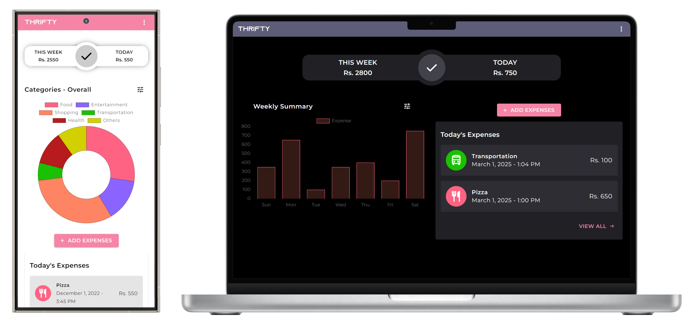

# Thrifty

Thrifty is a web application for expense tracking. It includes visualizations and powerful search tools to help you have a better grip on your finances.

Thrifty is available at https://thrifty.pages.dev/.

# Features

- A responsive web application, looks great across phones and desktops
- Powerful search features to find the exact transaction you are looking for
- Visualizations that summarize your spending habits
- Option to set a weekly spending limit
- Supports dark mode and light mode

# Objectives

The objectives of Thrifty are:

- To assist users with managing their finances
- To track daily and weekly expenditures
- To highlight products or services where the user has spent excess money

# Directories

| Directory | Description |
|---|---|
|`backend` | Python and FastAPI backend |
| `web` | Svelte frontend |
| `docs` | draw.io diagrams, etc. |

# Development Setup

## Backend Setup

Make sure you have Python (>=3.7) and pip installed before beginning the setup process.

First, install PDM: `pip install --user pdm`.\
**IMPORTANT:** This will be the only time pip will be used in this project. You must use PDM in place of pip. [See below for more details.](#pdm-over-pip)

Once installed, `cd` into the `backend` directory, and run: `pdm install`.

Once PDM finishes installing all the dependencies, you can run `pdm run start` to start the backend server.

Note: You may run into a couple of issues for backend setup.

1. If `pdm` is not found after installing it with pip, it may not be in PATH. Make sure PDM is in PATH. It should be located in `%appdata%\Python\Python<version>\Scripts` (Windows).
2. VSCode may not use the virtualenv Python install as the interpreter for this project. You may have to set this manually. The virtualenv Python install is at: `backend/.venv/Scripts/python.exe` (for Windows).

### PDM over pip

PDM allows group project dependencies to be maintained much easily than with pip. So, pip will not be used in this project. To install packages with pdm, use: `pdm add <package name>`.

Example: ~~`pip install fastapi`~~ → `pdm add fastapi`\
(This is only an example, this project is already configured with FastAPI.)

## Frontend Setup

Make sure you have NodeJS 16 and NPM installed.

`cd` into the `web` directory, and run: `npm install`.

To work on the frontend, run: `npm run dev`.

## VSCode Setup

### Extensions

1. Svelte for VS Code
2. Prettier
3. ESLint
4. Python

These extensions will automatically be recommended when you open this repository in VSCode.

### Automatic Tasks

> Only do these steps after you have completed the setups for frontend and backend

Press `Ctrl + Shift + P`, and search for "Tasks: Manage Automatic Tasks in Folder". Press Enter, and select the "Allow Automatic Tasks in Folder" option. Relaunch VSCode, and both the frontend and backend development servers will be initialized automatically.
